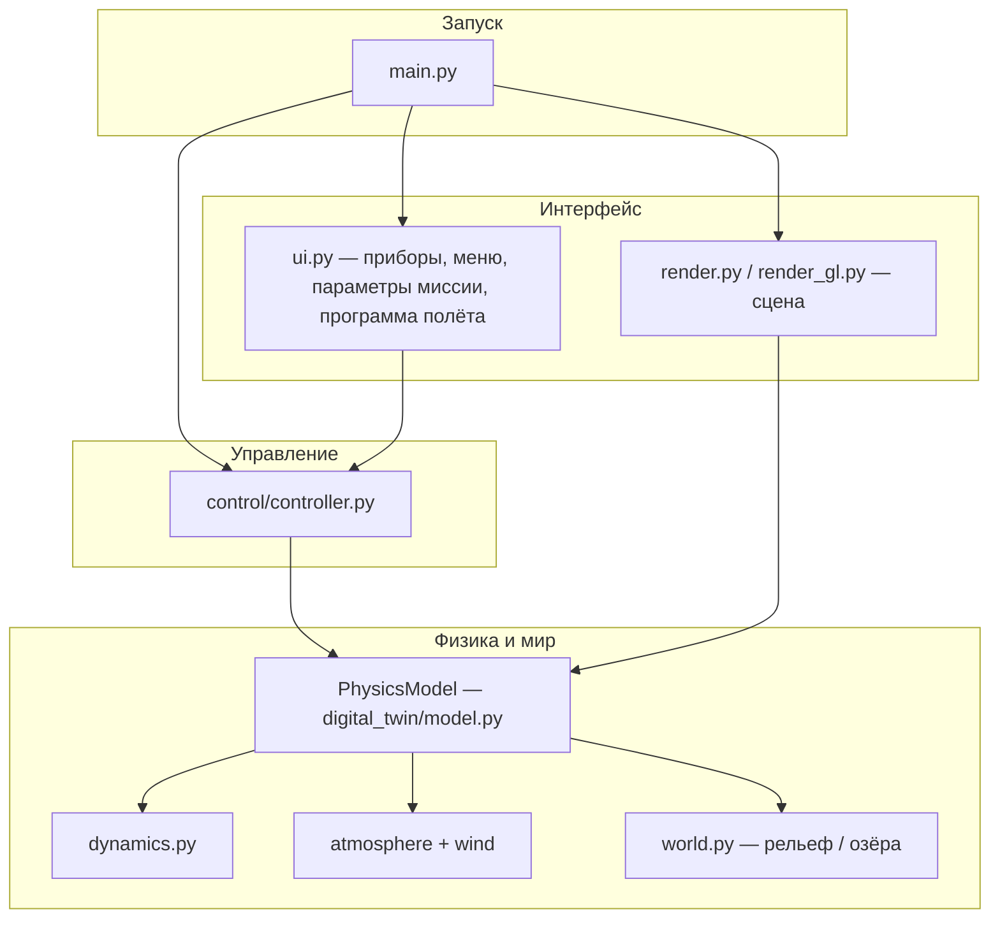

# Симулятор посадки на Титан (Pygame)

**English:** [README_EN.md](README_EN.md)

---

## Содержание

| Раздел | Описание |
|--------|----------|
| [О проекте](#о-проекте) | Назначение, что входит в модель |
| [Установка](#установка-python-и-окружения) | Python, venv, зависимости |
| [Запуск](#запуск) | Команда `main.py` и готовый бинарник |
| [Управление](#управление-как-пользоваться-симулятором) | Пульт, клавиши, CSV |
| [Программа полёта (RU)](FLIGHT_PROGRAM_RU.md) | Скрипт автопилота (`tick(sim, ap)`) |
| [Flight program (EN)](FLIGHT_PROGRAM_EN.md) | Same document in English |
| [Ключевые формулы](#ключевые-формулы) | Тяга, Мах, сопротивление, атмосфера |
| [Этапы посадки](#этапы-посадки) | Фазы спуска |
| [Структура кода](#структура-кода-кратко) | Файлы проекта |
| [Архитектура](#архитектура) | Блок-схемы потоков данных |
| [Данные и лицензия](#данные-и-лицензия) | `data/`, MIT |
| [Ссылки](#ссылки) | ESA Huygens |

---

## О проекте

Это интерактивный учебный симулятор спуска и мягкой посадки на Титан. Вы управляете последовательностью систем спускаемого аппарата, выбираете точку на карте и стараетесь завершить миссию в пределах допустимых перегрузок, температур и скоростей касания.

Физика вынесена в отдельный слой (`digital_twin`), визуализация и пульт — в Pygame: модель можно менять, не трогая графику.

### Что моделируется

| Область | Содержание |
|---------|------------|
| **Гравитация** | Постоянное ускорение у поверхности Титана |
| **Атмосфера** | Вертикальный профиль Титана из `data/titan_atm.json` (Huygens HASI L4, NASA PDS) |
| **Состояние газа** | В уравнениях движения — суммарные $\rho$, $T$, $P$ по высоте |
| **Аэродинамика** | Квадратичное сопротивление; парашюты и сброс теплозащиты меняют $C_d$ и площадь |
| **Ветер** | **Huygens DWE**: зональная скорость и формальная σ из `ZONALWIND.TAB`, меридиональная составляющая (сдвиг по высоте), плавное ослабление выше потолка DWE; **турбулентные пульсации** (Ornstein–Uhlenbeck, масштаб от σ и `WindConfig`) накладываются в `PhysicsModel` |
| **Тепло** | **Обшивка** (`HeatshieldThermalConfig`): редуцированная модель $dT_{\mathrm{skin}}/dt$ — конвективный прокси $\propto \rho^{\alpha}|v_{\mathrm{rel}}|^{\beta}$, редкость $\rho/(\rho+\rho_{\mathrm{knee}})$, сдув, абляционный сток, охлаждение к $T_{\mathrm{ext}}$ (газ $\propto \rho/(\rho+\rho_{\mathrm{ref}})$ + слабая «радиация»); коэффициент нагрева подобран так, чтобы на типичной траектории были ощутимые накал и приборы; при превышении предела — отказ. **Отсеки** (`ThermalConfig`): обмен с атмосферой слабый и **масштабируется по $\rho$** (в разреженном воздухе почти нет «замерзания» к $T_{\mathrm{ext}}$); постоянная модельная мощность борта; **пока теплозащита на месте** — тепло **только от горячей обшивки** ($\max(0, T_{\mathrm{skin}}-T_{\mathrm{int}})$); после сброса — нагрев корпуса от $q_{\mathrm{dyn}}$ |
| **Сцена** | Облака и туман в визуализации |
| **Двигатель** | Тяга и расход топлива |
| **Поверхность** | Процедурный рельеф, суша и жидкие области |
| **Исход миссии** | Успех / отказ: перегрузка, температура отсеков, **перегрев обшивки** (пока теплозащита не сброшена), топливо, жёсткая посадка, несоответствие типа поверхности цели, столкновение с рельефом |

---

## Установка Python и окружения

### 1. Python

Нужен **Python 3.10 или новее**.

| Платформа | Действие |
|-----------|----------|
| **Windows** | Установщик с [python.org](https://www.python.org/downloads/), опция **«Add Python to PATH»**. Проверка: `python --version` |
| **Linux** | Например: `sudo apt install python3 python3-venv python3-pip`. Проверка: `python3 --version` |
| **macOS** | `brew install python@3.12` или установщик с python.org |

### 2. Клонирование / папка проекта

```bash
cd /путь/к/titan
```

### 3. Виртуальное окружение (рекомендуется)

```bash
python3 -m venv .venv
```

Активация:

| Среда | Команда |
|-------|---------|
| **Linux / macOS** | `source .venv/bin/activate` |
| **Windows (cmd)** | `.venv\Scripts\activate.bat` |
| **Windows (PowerShell)** | `.venv\Scripts\Activate.ps1` |

В приглашении появится префикс `(.venv)`.

### 4. Зависимости

```bash
pip install -r requirements.txt
```

---

## Запуск

```bash
python main.py
```

По умолчанию игра стартует в полноэкранном режиме. Окно можно переключить клавишей **F11**.

### Готовый бинарник (`standalone/`)

Собранные приложения лежат в **`standalone/`** — можно запускать без установки Python.

| Платформа | Файл | Запуск |
|-----------|------|--------|
| **Linux x86_64** | `standalone/linux/TitanLandingSimulator` | из корня репозитория: `./standalone/linux/TitanLandingSimulator` (при необходимости: `chmod +x standalone/linux/TitanLandingSimulator`) |
| **Windows** | `standalone/windows/TitanLandingSimulator.exe` | после локальной сборки скриптом `scripts\build_windows.ps1` |

Пересборка: на Linux — `./scripts/build_linux.sh`, на Windows — `.\scripts\build_windows.ps1` (скрипты создают при необходимости `.venv`, ставят `requirements.txt` и `scripts/requirements-build.txt` с PyInstaller, затем собирают `TitanLandingSimulator.spec`).

Если при запуске однофайлового бинарника на Linux появляется ошибка вроде **`Failed to extract libcrypto.so.3`** или сбоя распаковки: проверьте свободное место в **`/tmp`** и на диске (PyInstaller распаковывает содержимое во временный каталог; при переполнении диска распаковка падает). Убедитесь, что запускаете бинарник, собранный под ту же разрядность ОС (x86_64).

---

## Управление: как пользоваться симулятором

Интерфейс спроектирован как **пульт оператора**: приборы дают картину полёта, рычаги и слайдеры — ручное управление, мини-карта связывает вас с выбранной точкой посадки.

### Мини-карта и цель

**Клик по мини-карте** задаёт цель в мировых координатах и **ожидаемый тип поверхности** (суша или жидкость) в этой точке. Успешная посадка требует не только мягких скоростей, но и **совпадения** фактической поверхности под аппаратом с типом, выбранным для цели.

### Рычаги (теплозащита и парашюты)

- **Сброс теплозащиты** разрешён, когда число **Маха** $M = v_{\mathrm{rel}} / a$ ниже порога (по умолчанию $M < 2{,}5$; см. `heatshield_jettison_max_mach` в `digital_twin/config.py`). На сверхзвуке сброс заблокирован.
- **Тормозной парашют** — только **после** сброса теплозащиты. **Основной** — при $h < 160\ \mathrm{км}$ и уже раскрытом тормозном. **Сброс основного купола** в физике разрешён, как только раскрыт основной (игрок / автопилот). Высота сброса по ТЗ (**2 км**) или по профилю Huygens (**22 км**) задаётся в **программе полёта** (`DEFAULT_SCRIPT` / `HUYGENS_SCRIPT`); поле `parachute_jettison_max_alt_m` в `config` — номинал ТЗ для подсказок. Опционально `science_descent_min_s` (по умолчанию **0**). Порог раскрытия основного: `parachute_main_max_deploy_alt_m`.
- Режим **Авто** по умолчанию вызывает `request_*` ровно тогда, когда соответствующий `can_*` истинен (см. `DEFAULT_SCRIPT` в `flight_program/runner.py`).
- Зелёный индикатор у рычага означает, что действие **разрешено правилами безопасности** в данный момент.

### Двигатель

Тумблер **вкл/выкл** и **слайдер тяги** (0–100 %). Расход массы топлива задаётся соотношением из раздела [Ключевые формулы](#ключевые-формулы). Без топлива при включённом двигателе на высоте возможен отказ сценария.

### Авто и ручной режим

| Режим | Поведение |
|-------|-----------|
| **Авто** | Логика из **программы полёта** (`tick(sim, ap)`); по умолчанию — та же последовательность: теплозащита, парашюты, сброс, двигатель у поверхности |
| **Ручной** | Все решения за вами — удобно для экспериментов и обучения |

### Пауза и меню

Кнопка **Пауза** в правом верхнем углу, **Esc** или **Пробел** открывают меню: продолжить, авто/ручной, язык **RU/EN**, рестарт, запись **CSV**, **программирование полёта**, выход.

### Программа автопилота (режим «Авто»)

Поведение **Авто** задаётся скриптом на ограниченном Python: пункт меню **«Программирование полёта»** (редактор с подсказками API, подсветкой синтаксиса и проверкой `tick()` при сохранении). Полное описание — **[FLIGHT_PROGRAM_RU.md](FLIGHT_PROGRAM_RU.md)**; на английском — **[FLIGHT_PROGRAM_EN.md](FLIGHT_PROGRAM_EN.md)**.

### Горячие клавиши

| Клавиша | Действие |
|---------|----------|
| **R** | Быстрый рестарт |
| **A** | Переключение авто / ручной |
| **F1** | Краткая справка |
| **+** / **−** | Ускорение / замедление модельного времени |
| **F11** | Полный экран |
| **Esc**, **Пробел** | Меню паузы |

После завершения миссии поверх интерфейса показываются **графики** телеметрии (высота, вертикальная скорость, перегрузка); кнопка паузы рисуется поверх графиков и остаётся доступной.

### Запись траектории (CSV)

В меню паузы можно включить лог: файлы появляются в каталоге `logs/` рядом с проектом.

---

## Ключевые формулы

Ниже — соответствие обозначений тому, как величины используются в коде и на приборах.

### Расход топлива (модель двигателя)

Массовый расход при заданной тяге $T$:

$$
\dot{m} \;=\; \frac{T}{I_{\mathrm{sp}}\, g_0}
$$

| Символ | Смысл | Типичные единицы |
|--------|--------|------------------|
| $\dot{m}$ | Масса топлива в единицу времени | кг/с |
| $T$ | Тяга | Н |
| $I_{\mathrm{sp}}$ | Удельный импульс | с |
| $g_0$ | Эталонное ускорение свободного падения | 9.80665 м/с² |

### Скорость звука и число Маха

Для оценки $M$ используется скорость звука идеального газа:

$$
a \;=\; \sqrt{\gamma\, R\, T(h)}
$$

$$
M \;=\; \frac{|\mathbf{v}_{\mathrm{rel}}|}{a}
$$

| Символ | Смысл |
|--------|--------|
| $\gamma$ | Показатель адиабаты |
| $R$ | Удельная газовая постоянная (смесь, ориентир — N₂) |
| $T(h)$ | Температура по высоте из атмосферного профиля |
| $\mathbf{v}_{\mathrm{rel}}$ | Скорость относительно воздуха (учёт ветра) |

### Квадратичное аэродинамическое сопротивление

$$
\mathbf{F}_d \;=\; -\tfrac{1}{2}\,\rho(h)\, C_d\, A\, \bigl|\mathbf{v}_{\mathrm{rel}}\bigr|\,\mathbf{v}_{\mathrm{rel}}
$$

| Символ | Смысл |
|--------|--------|
| $\rho(h)$ | Плотность воздуха по высоте |
| $C_d$ | Коэффициент сопротивления (зависит от конфигурации) |
| $A$ | Опорная площадь |

### Атмосфера по высоте

На каждой высоте задаются (таблица или экспоненциальный профиль):

$$
\rho = \rho(h),\qquad T = T(h),\qquad P = P(h)
$$

### Тепло: температура обшивки теплозащиты

Пока теплозащита не сброшена, для $T_{\mathrm{skin}}$ используется явный шаг по времени с правой частью в духе «стагнационного» прокси (см. `heatshield_skin_dTdt` в `digital_twin/dynamics.py`). Учитывается:

- **Нагрев** — ведущий член $\propto k_{\mathrm{friction}}\,\rho^{\alpha}|v_{\mathrm{rel}}|^{\beta}$ с **редкостным сглаживанием** $\rho/(\rho+\rho_{\mathrm{knee}})$: в очень разреженном газе нагрев слабеет.
- **Сдув / пиролиз** — уменьшает конвективный поток при высокой $T_{\mathrm{skin}}$ (граничный слой «дует» в сторону потока).
- **Абляционное охлаждение** — дополнительный сток энтальпии при $T_{\mathrm{skin}}$ выше порога (без отдельной массовой ОДУ).
- **Охлаждение к $T_{\mathrm{ext}}(h)$** — двумя каналами: **газовый** обмен, масштаб $\propto \rho/(\rho+\rho_{\mathrm{ref}})$, и **слабый радиативный** к холодному небу (чтобы в вакууме $T_{\mathrm{skin}}$ не «липла» к одному только газу).

Коэффициент $k_{\mathrm{friction}}$ в `HeatshieldThermalConfig` **подогнан по симулятору** (редуцированная модель, не прямой пересчёт флюкса Huygens), чтобы на типичном входе были правдоподобные накал на сцене и показания термометра обшивки. Значения $\alpha$, $\beta$ по умолчанию — $1$ и $3$ (наследие обозначения «$\rho|v|^3$»).

Если $T_{\mathrm{skin}}$ превышает **предел прочности/аблятора** (`skin_failure_temp_c`), пока теплозащита **на месте**, фиксируется **отказ миссии** — это игровой порог целостности, не табличная величина HASI.

### Тепло: температура внутренних отсеков

Скорость изменения $T_{\mathrm{int}}$ (`thermal_relaxation_step`):

$$
\frac{dT_{\mathrm{int}}}{dt}
  = k_{\mathrm{relax}}\,g_{\rho}\,\bigl(T_{\mathrm{ext}}-T_{\mathrm{int}}\bigr)
  + \frac{P_{\mathrm{bus}}}{C}
  + \begin{cases}
      k_{\mathrm{couple}}\,\max\bigl(0,\,T_{\mathrm{skin}}-T_{\mathrm{int}}\bigr) & \text{теплозащита стоит} \\[0.4em]
      k_{q}\,q_{\mathrm{dyn}} & \text{после сброса}
    \end{cases}
$$

$$
g_{\rho} = \frac{\rho}{\rho+\rho_{\mathrm{knee,relax}}}
$$

**Зачем так:** по смыслу учебного сценария (как в таблице выше) отсеки **не должны** мгновенно принимать температуру свободного потока: изоляция и малый обмен на больших высотах моделируются **малым** $k_{\mathrm{relax}}$ и множителем $g_{\rho}$ — в разреженном воздухе прямой «отсос» к $T_{\mathrm{ext}}$ почти выключен. $P_{\mathrm{bus}}$ — суммарная модельная мощность борта (поле `rtg_w` в конфиге, без привязки к РИТЭГ Huygens). **Связь с обшивкой односторонняя:** добавляется только нагрев, когда обшивка **горячее** отсеков; холодная внешняя поверхность **не** тянет $T_{\mathrm{int}}$ вниз тем же коэффициентом (упрощение МЛИ/тента). После сброса теплозащиты вклад от обшивки отключается, остаётся обмен с атмосферой, борт и **аэродинамический нагрев** корпуса $\propto q_{\mathrm{dyn}}$.

Константы — в `ThermalConfig` (`digital_twin/config.py`).

### Визуализация накала

Цвет и аддитивное свечение оболочки на экране зависят от $T_{\mathrm{skin}}$; для закопчения в смеси с динамическим давлением используется тот же порядок величин, что и в аэродинамике, — **$|\mathbf{v}_{\mathrm{rel}}|$**, а не только вертикальная скорость.

---

## Этапы посадки

Ниже — логическая цепочка спуска, близкая к миссии вроде Huygens, в терминах симулятора.

| № | Фаза | Что происходит |
|---|------|------------------|
| 1 | **Вход (`entry`)** | Высокая скорость, рост $\rho$ книзу, сильное аэроторможение. Профиль **$\rho(h), T(h), P(h)$**; **ветер** по профилю Huygens DWE смещает $\mathbf{v}_{\mathrm{rel}}$ и $\mathbf{F}_d$. **Обшивка** — редкость газа, сдув и абляция поверх простого $\rho|\mathbf{v}|^3$; **внутренние отсеки** получают тепло от обшивки. Накал и термометр на HUD. Визуально: небо, туман, облака; при сбросе теплозащиты — частицы. |
| 2 | **Сброс теплозащиты** | После снижения $M$: меньше масса, другие $C_d$ и площадь. |
| 3 | **Тормозной парашют (`drogue_chute`)** | Рост $C_d$ и $A$ — заметное торможение в плотных слоях. |
| 4 | **Основной (`main_chute`; опционально `science_descent`)** | Большая площадь и $C_d$. Фаза `science_descent` в телеметрии только если `science_descent_min_s` > 0. |
| 5 | **Сброс парашюта, финальный спуск** | Снова «корпусная» аэродинамика; у поверхности — **двигатель** (ручной или авто). |
| 6 | **Касание** | Пороги скоростей (для жидкости выше по вертикали), перегрузка, температура, тип поверхности vs цель, экстремальные удары / проникновение под модель рельефа. |

**Рельеф:** процедурная высота и маска озёр; на мини-карте и в разрезе у поверхности — **дюны/холмы** и **озёра**.

---

## Структура кода (кратко)

| Путь | Назначение |
|------|------------|
| `main.py` | Цикл Pygame, накопитель шага физики, вызов `Renderer.draw` |
| `digital_twin/model.py` | `PhysicsModel`: силы, интегратор, посадка, CSV, история для графиков |
| `digital_twin/dynamics.py` | Drag, thrust, fuel, thermal step, Euler helpers для `SimState` |
| `digital_twin/config.py` | Константы тела, двигателя, тепла, пороги Маха; опционально `science_descent_min_s` |
| `digital_twin/models/atmosphere.py` | Таблица JSON и экспоненциальный профиль |
| `digital_twin/models/wind.py` | Ветер vs высота |
| `digital_twin/world.py` | Рельеф и тип поверхности |
| `control/` | Команды UI → модель |
| `flight_program/` | Скрипт автопилота: `runner.py` (API, валидация), `highlighter.py` (подсветка в редакторе) |
| `ui.py` | Приборы, рычаги, i18n, графики после посадки |
| `render.py` | Сцена, мини-карта, порядок отрисовки |

---

## Архитектура

Ниже — упрощённые блок-схемы (Mermaid; на GitHub отображаются как диаграммы).

### Общая структура приложения



### Поток данных за кадр

```mermaid
sequenceDiagram
    participant Loop as main loop
    participant UI as UI
    participant Ctrl as Controller
    participant Model as PhysicsModel
    Loop->>UI: события, sync_from_twin
    UI->>Ctrl: queue(Command)
    Loop->>Ctrl: consume_and_apply
    Ctrl->>Model: рычаги, цель, CSV
    Loop->>Model: step(dt)
    Loop->>UI: draw приборов
    Loop->>Model: данные для render
```

---

## Данные и лицензия

| Файл | Назначение |
|------|------------|
| `data/titan_atm.json` | Атмосфера Huygens HASI L4 (давление, температура, плотность; на входе плотность по идеальному газу из P и T). Исходные TAB: `data/nasa_pds/hasi_profiles/` |
| `data/titan_wind_huygens.json` | DWE: зональная скорость, σ (кол. 4 TAB), меридиональная модель; выше потолка DWE — сглаженное ослабление до 1400 км (`scripts/parse_pds_titan.py`) |
| `data/huygens_velocity_telemetry.json` | Скорость зонда HASI L4 (`HASI_L4_VELOCITY_PROFILE.TAB`). Данные миссии; состояние интегратора симулятора задаётся отдельно |
| `data/nasa_pds/` | Архив NASA/JPL/PDS: PDF и TAB/LBL; см. `data/nasa_pds/README_SOURCES.md` |
| `data/surface_map.meta.json` | Метаданные и ссылки по маске поверхности |
| `LICENSE` | Лицензия проекта: **MIT** |

Ссылки на каталоги и документы (дублируются в метаданных JSON):

- [PDS: HASI mission dataset](https://pds.nasa.gov/ds-view/pds/viewDataset.jsp?dsid=HP-SSA-HASI-2-3-4-MISSION-V1.1)
- [PDS: DWE descent wind](https://pds.nasa.gov/ds-view/pds/viewDataset.jsp?dsid=HP-SSA-DWE-2-3-DESCENT-V1.0)
- [PDS Atmospheres Node — Huygens HASI bundle](https://atmos.nmsu.edu/PDS/data/PDS4/Huygens/hphasi_bundle/)
- [PDS Atmospheres Node — Huygens DWE bundle](https://atmos.nmsu.edu/PDS/data/PDS4/Huygens/hpdwe_bundle/)
- [NASA Science — Cassini fact sheet (PDF)](https://assets.science.nasa.gov/content/dam/science/psd/solar/2023/09/c/cassinifactsheet.pdf)
- [JPL Descanso — Cassini telecom (PDF)](https://descanso.jpl.nasa.gov/DPSummary/Descanso3--Cassini.pdf)

---

## Ссылки

- ESA: [Huygens overview](https://sci.esa.int/web/cassini-huygens/-/47052-huygens)
