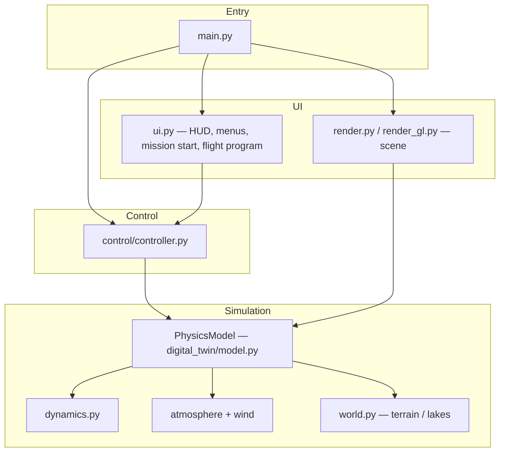

# Titan Landing Simulator (Pygame)

**Russian:** [README.md](README.md)

---

## Contents

| Section | Description |
|---------|-------------|
| [About](#about) | Purpose and scope of the model |
| [Installing](#installing-python-and-the-project) | Python, venv, dependencies |
| [Run](#run) | `main.py` and standalone binaries |
| [Controls](#controls-using-the-simulator) | Console, keys, CSV |
| [Flight program (EN)](FLIGHT_PROGRAM_EN.md) | Autopilot script (`tick(sim, ap)`) |
| [Программа полёта (RU)](FLIGHT_PROGRAM_RU.md) | Same document in Russian |
| [Key formulas](#key-formulas) | Thrust, Mach, drag, atmosphere |
| [Landing phases](#landing-phases) | Descent timeline |
| [Code map](#code-map) | Project layout |
| [Architecture](#architecture) | Data-flow diagrams |
| [Data and license](#data-and-license) | `data/`, MIT |
| [Links](#links) | ESA Huygens |

---

## About

This is an interactive educational simulator of descent and soft landing on Titan. You control the sequence of descent systems, pick a site on the map, and try to finish within load, temperature, and touchdown speed limits.

Physics lives in `digital_twin`; Pygame handles the world and cockpit so you can tune the model without touching graphics.

### What the simulation includes

| Area | Content |
|------|---------|
| **Gravity** | Constant acceleration at Titan’s surface |
| **Atmosphere** | Titan vertical profile in `data/titan_atm.json` (Huygens HASI L4, NASA PDS) |
| **Gas state** | Bulk $\rho$, $T$, $P$ vs altitude in the equations of motion |
| **Aerodynamics** | Quadratic drag; parachutes and heatshield jettison change $C_d$ and area |
| **Wind** | **Huygens DWE** zonal wind plus formal σ from `ZONALWIND.TAB`, altitude-varying meridional component, smooth decay above the DWE top; **OU turbulence** scaled by σ and `WindConfig`, applied in `PhysicsModel` |
| **Thermal** | **Skin** (`HeatshieldThermalConfig`): reduced-order $dT_{\mathrm{skin}}/dt$ — convective proxy $\propto \rho^{\alpha}|v_{\mathrm{rel}}|^{\beta}$, rarefaction $\rho/(\rho+\rho_{\mathrm{knee}})$, blowing, ablative cooling, and relaxation toward $T_{\mathrm{ext}}(h)$ (gas coupling $\propto \rho/(\rho+\rho_{\mathrm{ref}})$ plus a weak radiative term); the leading heating coefficient is **tuned in-sim** so a nominal entry shows glow and HUD readings; exceeding a **skin temperature limit** fails the mission. **Bays** (`ThermalConfig`): exchange with the atmosphere is **weak** and **$\rho$-weighted** (little “soak” to $T_{\mathrm{ext}}$ in rarefied air); constant modeled bus power; **with heatshield attached**, heat from the shell uses **one-way coupling** $\max(0, T_{\mathrm{skin}}-T_{\mathrm{int}})$; **after jettison**, hull heating from dynamic pressure $q_{\mathrm{dyn}}$ |
| **Scene** | Clouds and haze in the visualization |
| **Propulsion** | Thrust and fuel consumption |
| **Surface** | Procedural terrain, land and liquid regions |
| **Outcome** | Success / failure: overload, bay temperature, **heatshield skin overheat** (while heatshield still attached), fuel, hard landing, surface-type mismatch vs target, terrain collision |

---

## Installing Python and the project

### 1. Python

**Python 3.10+** required.

| Platform | Steps |
|----------|--------|
| **Windows** | Installer from [python.org](https://www.python.org/downloads/), enable **Add Python to PATH**. Check: `python --version` |
| **Linux** | e.g. `sudo apt install python3 python3-venv python3-pip`. Check: `python3 --version` |
| **macOS** | e.g. `brew install python@3.12` or the python.org installer |

### 2. Project folder

```bash
cd /path/to/titan
```

### 3. Virtual environment (recommended)

```bash
python3 -m venv .venv
```

Activate:

| Shell | Command |
|-------|---------|
| **Linux / macOS** | `source .venv/bin/activate` |
| **Windows (cmd)** | `.venv\Scripts\activate.bat` |
| **Windows (PowerShell)** | `.venv\Scripts\Activate.ps1` |

### 4. Dependencies

```bash
pip install -r requirements.txt
```

---

## Run

```bash
python main.py
```

The game starts fullscreen by default. **F11** toggles fullscreen.

### Ready-built binaries (`standalone/`)

Prebuilt apps live under **`standalone/`** — no Python install required.

| Platform | File | How to run |
|----------|------|------------|
| **Linux x86_64** | `standalone/linux/TitanLandingSimulator` | From repo root: `./standalone/linux/TitanLandingSimulator` (if needed: `chmod +x standalone/linux/TitanLandingSimulator`) |
| **Windows** | `standalone/windows/TitanLandingSimulator.exe` | produced locally by `scripts\build_windows.ps1` |

Rebuild: Linux — `./scripts/build_linux.sh`, Windows — `.\scripts\build_windows.ps1` (each creates `.venv` if needed, installs `requirements.txt` plus `scripts/requirements-build.txt` including PyInstaller, then builds `TitanLandingSimulator.spec`).

If the Linux one-file binary fails with **`Failed to extract libcrypto.so.3`** or a decompression error: check free space under **`/tmp`** and on the drive (PyInstaller unpacks there; a full disk breaks extraction). Run a build that matches your OS ABI (x86_64).

---

## Controls: using the simulator

The UI is an **operator console**: instruments show the flight state; levers and sliders are your hands on the vehicle; the minimap ties you to the chosen landing site.

### Minimap and target

**Click the minimap** to set a goal in world coordinates and the **expected surface type** (land vs liquid) at that point. Success requires soft speeds **and** a match between the surface under the probe and the target’s stored type.

### Levers (heatshield and parachutes)

- **Heatshield jettison** when **Mach** $M = v_{\mathrm{rel}} / a$ is below the limit (default $M < 2.5$, `heatshield_jettison_max_mach` in `digital_twin/config.py`). Blocked while hypersonic.
- **Drogue** only **after** heatshield jettison. **Main** chute when $h < 160\ \mathrm{km}$ and drogue is already deployed. **Main canopy jettison** is allowed by physics whenever the main is deployed (player / autopilot). Release altitude per spec (**2 km**) or Huygens (**22 km**) is enforced in the **flight program** (`DEFAULT_SCRIPT` / `HUYGENS_SCRIPT`); `parachute_jettison_max_alt_m` in `config` is the nominal spec value for hints. Optional `science_descent_min_s` (default **0**). Main deploy ceiling: `parachute_main_max_deploy_alt_m`.
- Default **Auto** issues `request_*` when the matching `can_*` is true (`DEFAULT_SCRIPT` in `flight_program/runner.py`).
- A **green lamp** on a lever means the action is **currently allowed** by the safety rules.

### Engine

**On/off** toggle and **throttle** slider (0–100 %). Fuel mass flow follows the relation in [Key formulas](#key-formulas). Running the engine out of fuel while airborne can fail the run.

### Auto vs manual

| Mode | Behavior |
|------|----------|
| **Auto** | Sequence from the editable **flight program** (`tick(sim, ap)`); default matches the classic heatshield → chutes → engine assist |
| **Manual** | You drive every decision — good for experiments and learning |

### Pause menu

**Pause** (top right), **Esc**, or **Space** open the menu: resume, auto/manual, **RU/EN**, restart, **CSV** logging, **flight program** editor, quit.

### Flight program (Auto mode)

**Auto** is driven by a restricted Python script edited from the pause menu (**Flight program**): API hints, syntax highlighting, and a dry-run **`tick()`** check on save. Full reference — **[FLIGHT_PROGRAM_EN.md](FLIGHT_PROGRAM_EN.md)**; in Russian — **[FLIGHT_PROGRAM_RU.md](FLIGHT_PROGRAM_RU.md)**.

### Keyboard shortcuts

| Key | Action |
|-----|--------|
| **R** | Quick restart |
| **A** | Toggle auto / manual |
| **F1** | Short help overlay |
| **+** / **−** | Faster / slower simulation time |
| **F11** | Fullscreen |
| **Esc**, **Space** | Pause menu |

After landing, **telemetry plots** overlay the HUD; the **Pause** control is drawn on top and stays usable.

### CSV trajectory log

From the pause menu you can enable logging under `logs/` next to the project.

---

## Key formulas

Symbols below match how quantities are used in code and on instruments.

### Fuel mass flow (engine model)

For thrust $T$:

$$
\dot{m} \;=\; \frac{T}{I_{\mathrm{sp}}\, g_0}
$$

| Symbol | Meaning | Typical units |
|--------|---------|----------------|
| $\dot{m}$ | Fuel mass flow rate | kg/s |
| $T$ | Thrust | N |
| $I_{\mathrm{sp}}$ | Specific impulse | s |
| $g_0$ | Standard gravity | 9.80665 m/s² |

### Speed of sound and Mach number

$$
a \;=\; \sqrt{\gamma\, R\, T(h)}
$$

$$
M \;=\; \frac{|\mathbf{v}_{\mathrm{rel}}|}{a}
$$

| Symbol | Meaning |
|--------|---------|
| $\gamma$ | Heat-capacity ratio |
| $R$ | Specific gas constant (mixture; N₂-dominated reference) |
| $T(h)$ | Temperature from the atmospheric profile |
| $\mathbf{v}_{\mathrm{rel}}$ | Velocity relative to the air (wind included) |

### Quadratic aerodynamic drag

$$
\mathbf{F}_d \;=\; -\tfrac{1}{2}\,\rho(h)\, C_d\, A\, \bigl|\mathbf{v}_{\mathrm{rel}}\bigr|\,\mathbf{v}_{\mathrm{rel}}
$$

| Symbol | Meaning |
|--------|---------|
| $\rho(h)$ | Air density vs altitude |
| $C_d$ | Drag coefficient (configuration-dependent) |
| $A$ | Reference area |

### Atmosphere vs altitude

At each altitude (table or exponential profile):

$$
\rho = \rho(h),\qquad T = T(h),\qquad P = P(h)
$$

### Thermal: heatshield skin temperature

Until the heatshield is jettisoned, $T_{\mathrm{skin}}$ is advanced with an explicit time step; see `heatshield_skin_dTdt` in `digital_twin/dynamics.py`. The model includes:

- **Heating** — leading term $\propto k_{\mathrm{friction}}\,\rho^{\alpha}|v_{\mathrm{rel}}|^{\beta}$ with **rarefaction** $\rho/(\rho+\rho_{\mathrm{knee}})$ so heating weakens in very thin air.
- **Blowing / pyrolysis** — reduces convective heating when $T_{\mathrm{skin}}$ is high (boundary-layer proxy).
- **Ablative cooling** — extra enthalpy loss above an onset temperature (no separate mass ODE).
- **Cooling toward $T_{\mathrm{ext}}(h)$** — **gas-side** exchange scaled by $\rho/(\rho+\rho_{\mathrm{ref}})$ plus a **weak radiative** sink to cold sky (avoids over-coupling $T_{\mathrm{skin}}$ to gas in near-vacuum).

The coefficient $k_{\mathrm{friction}}$ in `HeatshieldThermalConfig` is **tuned for this simulator** (reduced-order model, not a direct reconstruction of Huygens flux). Defaults $\alpha=1$, $\beta=3$ keep the legacy “$\rho|v|^3$” naming.

If $T_{\mathrm{skin}}$ exceeds a **structural/ablator cap** (`skin_failure_temp_c`) **while the heatshield is still on**, the mission **fails** — a gameplay integrity limit, not a HASI table value.

### Thermal: internal bay temperature

Rate of change $T_{\mathrm{int}}$ (`thermal_relaxation_step`):

$$
\frac{dT_{\mathrm{int}}}{dt}
  = k_{\mathrm{relax}}\,g_{\rho}\,\bigl(T_{\mathrm{ext}}-T_{\mathrm{int}}\bigr)
  + \frac{P_{\mathrm{bus}}}{C}
  + \begin{cases}
      k_{\mathrm{couple}}\,\max\bigl(0,\,T_{\mathrm{skin}}-T_{\mathrm{int}}\bigr) & \text{heatshield on} \\[0.4em]
      k_{q}\,q_{\mathrm{dyn}} & \text{after jettison}
    \end{cases}
$$

$$
g_{\rho} = \frac{\rho}{\rho+\rho_{\mathrm{knee,relax}}}
$$

**Rationale:** for the educational scenario, bays must **not** instantly match free-stream temperature: insulation and weak exchange at altitude are represented by a **small** $k_{\mathrm{relax}}$ and the factor $g_{\rho}$ — in rarefied air, direct relaxation to $T_{\mathrm{ext}}$ is almost off. $P_{\mathrm{bus}}$ is total modeled bus dissipation (config field `rtg_w`; not tied to a real RTG on Huygens). **Skin coupling is one-way:** only heating when the shell is **hotter** than the bays; a cold outer surface does **not** pull $T_{\mathrm{int}}$ down through the same term (MLI / tent simplification). After jettison, skin coupling is removed; exchange with air, bus power, and **aerodynamic** hull heating $\propto q_{\mathrm{dyn}}$ remain.

Constants live in `ThermalConfig` (`digital_twin/config.py`).

### Entry glow visualization

Shell tint and additive glow depend on $T_{\mathrm{skin}}$; the char/dynamic-pressure blend uses **$|\mathbf{v}_{\mathrm{rel}}|$**, consistent with the aero path, not vertical speed alone.

---

## Landing phases

A Huygens-like descent chain in the simulator’s terms.

| # | Phase | What happens |
|---|-------|----------------|
| 1 | **Entry (`entry`)** | High speed; $\rho$ grows downward; strong aerobraking. **$\rho(h), T(h), P(h)$**; **Huygens DWE wind table** shifts $\mathbf{v}_{\mathrm{rel}}$ and $\mathbf{F}_d$. Heatshield: rarefaction, blowing, and ablation on top of a $\rho$–$|v|$ stagnation proxy. Visuals: sky gradient, haze, clouds; heatshield jettison can spawn particles. |
| 2 | **Heatshield jettison** | After $M$ drops: lower mass; new $C_d$ and area. |
| 3 | **Drogue (`drogue_chute`)** | Large $C_d$ and $A$ — strong deceleration in dense air. |
| 4 | **Main (`main_chute`; optional `science_descent`)** | Larger area and $C_d$. Telemetry phase `science_descent` only if `science_descent_min_s` > 0. |
| 5 | **Chute jettison, final descent** | Back to “bare” aero; **engine** (manual or auto) near the ground. |
| 6 | **Touchdown** | Speed limits (higher vertical cap on liquid), overload, temperature, surface vs target, extreme impact / penetration under the terrain height model. |

**Terrain:** procedural height and lakes; minimap and low-altitude **profile** show **dunes** and **lakes**.

---

## Code map

| Path | Role |
|------|------|
| `main.py` | Pygame loop, physics accumulator, `Renderer.draw` |
| `digital_twin/model.py` | `PhysicsModel`: forces, integrator, landing, CSV, plot history |
| `digital_twin/dynamics.py` | Drag, thrust, fuel, thermal, Euler helpers for `SimState` |
| `digital_twin/config.py` | Body, engine, thermal, Mach; optional `science_descent_min_s` |
| `digital_twin/models/atmosphere.py` | JSON table and exponential profile |
| `digital_twin/models/wind.py` | Wind vs altitude |
| `digital_twin/world.py` | Terrain and surface type |
| `control/` | UI commands → model |
| `flight_program/` | Autopilot script: `runner.py` (API, validation), `highlighter.py` (editor colors) |
| `ui.py` | Instruments, levers, i18n, post-landing plots |
| `render.py` | World draw order, minimap |

---

## Architecture

High-level block diagrams (Mermaid; rendered on GitHub).

### Application layout



### Per-frame data flow

```mermaid
sequenceDiagram
    participant Loop as main loop
    participant UI as UI
    participant Ctrl as Controller
    participant Model as PhysicsModel
    Loop->>UI: events, sync_from_twin
    UI->>Ctrl: queue(Command)
    Loop->>Ctrl: consume_and_apply
    Ctrl->>Model: levers, target, CSV
    Loop->>Model: step(dt)
    Loop->>UI: draw HUD
    Loop->>Model: telemetry for render
```

---

## Data and license

| File | Role |
|------|------|
| `data/titan_atm.json` | Huygens HASI L4 atmosphere (P, T, ρ; entry segment: ideal-gas ρ from P and T). Source TAB: `data/nasa_pds/hasi_profiles/` |
| `data/titan_wind_huygens.json` | DWE: zonal, σ (TAB col. 4), meridional model; above DWE top, smooth decay to 1400 km (`scripts/parse_pds_titan.py`) |
| `data/huygens_velocity_telemetry.json` | Huygens HASI L4 probe speed (`HASI_L4_VELOCITY_PROFILE.TAB`). Mission record; simulator state is integrated separately |
| `data/nasa_pds/` | NASA/JPL/PDS archive: PDFs and TAB/LBL; see `data/nasa_pds/README_SOURCES.md` |
| `data/surface_map.meta.json` | Metadata and references for the surface mask |
| `LICENSE` | **MIT** |

Catalog and document links (also in JSON metadata):

- [PDS: HASI mission dataset](https://pds.nasa.gov/ds-view/pds/viewDataset.jsp?dsid=HP-SSA-HASI-2-3-4-MISSION-V1.1)
- [PDS: DWE descent wind](https://pds.nasa.gov/ds-view/pds/viewDataset.jsp?dsid=HP-SSA-DWE-2-3-DESCENT-V1.0)
- [PDS Atmospheres Node — HASI bundle](https://atmos.nmsu.edu/PDS/data/PDS4/Huygens/hphasi_bundle/)
- [PDS Atmospheres Node — DWE bundle](https://atmos.nmsu.edu/PDS/data/PDS4/Huygens/hpdwe_bundle/)
- [NASA Science — Cassini fact sheet (PDF)](https://assets.science.nasa.gov/content/dam/science/psd/solar/2023/09/c/cassinifactsheet.pdf)
- [JPL Descanso — Cassini telecom (PDF)](https://descanso.jpl.nasa.gov/DPSummary/Descanso3--Cassini.pdf)

---

## Links

- ESA: [Huygens overview](https://sci.esa.int/web/cassini-huygens/-/47052-huygens)
